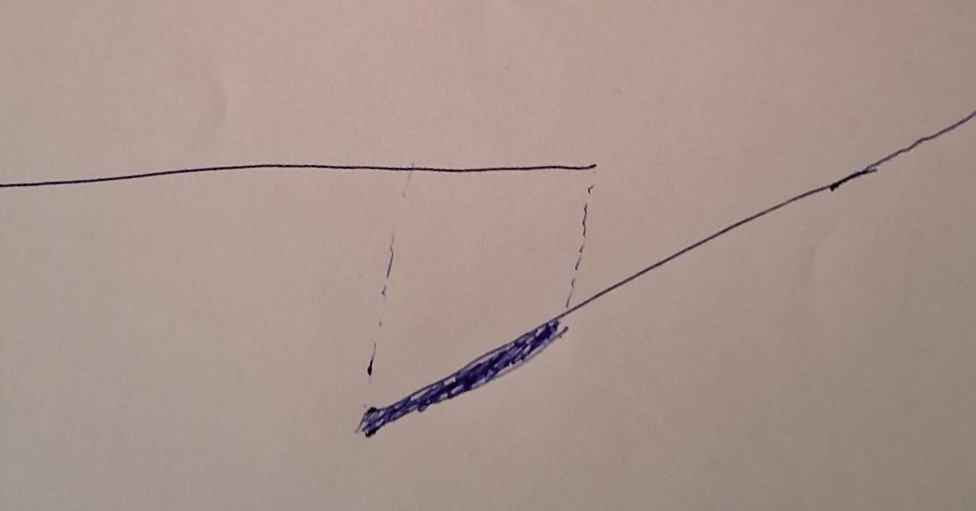
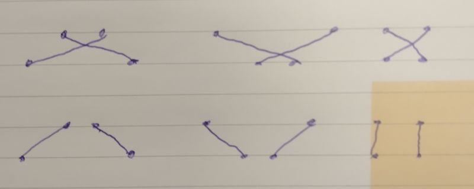
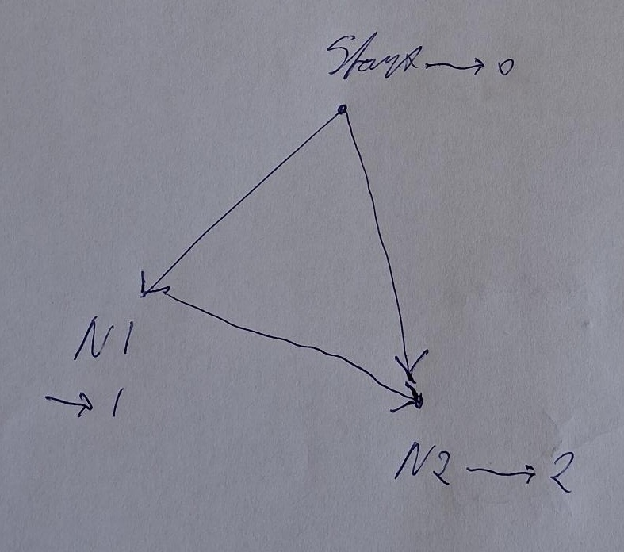

ALGORITHMS
==========

This document explains the algorithms applied by Frank config layout. Here is the table of contents:

- [Overview](#overview)
- [Counting line crosses](#counting-line-crosses)
  - [Exact determination whether two lines cross](#exact-determination-whether-two-lines-cross)
  - [Why x, y coordinates are not so important](#why-x-y-coordinates-are-not-so-important)
  - [Counting crossings with adjacent layers](#counting-crossings-with-adjacent-layers)
  - [Evaluating node swaps](#evaluating-node-swaps)
- [Establishing layers](#establishing-layers)
  - [How layer numbers are assigned](#how-layer-numbers-are-assigned)
  - [Usage of layer numbers](#usage-of-layer-numbers)

# Overview

We start with the big picture: the following steps are taken to transform an input file to an SVG image:

* The input file uses the syntax of Mermaid. Frank config layout parses it into a data structure that represents the nodes and the edges (a graph).
* Frank config layout establishes which nodes and which edges belong to the error flow - these are styled differently in the result (file [error-flow.ts](./projects/frank-config-layout/src/lib/model/error-flow.ts)).
* The nodes are grouped into horizontal layers that are stacked vertically (file [horizontal-grouping.ts](./projects/frank-config-layout/src/lib/model/horizontal-grouping.ts)).
* Within each layer, the nodes are sorted so that the number of edge crosses is minimized (file [layout-base.ts](./projects/frank-config-layout/src/lib/model/layout-base.ts)).
* Calculating positions of nodes and routes of edges is prepared (file [layout-model.ts](./projects/frank-config-layout/src/lib/model/layout-model.ts)).
* The positions of the nodes and the initial routes of the edges is calculated (file [layout.ts](./projects/frank-config-layout/src/lib/graphics/layout.ts)).
* The initial routes of the edges is changed to draw them more straight, with less changes of directions when layers are crossed (function `straighten()` in file [straightened-line.ts](./projects/frank-config-layout/src/lib/graphics/straightened-line.ts) called from [layout.ts](./projects/frank-config-layout/src/lib/graphics/layout.ts)).
* The positions of the edge labels (e.g. success, failure) are calculated (class `EdgeLabelLayouter` of file [edge-label-layouter.ts](./projects/frank-config-layout/src/lib/graphics/edge-label-layouter.ts) called from [layout.ts](./projects/frank-config-layout/src/lib/graphics/layout.ts)).

The algorithm aims to minimize the number of line crosses. To do this, the number of line crosses has to be calculated. Doing this is the subject of the next section.

# Counting line crosses

An important measure for the quality of a layout is the number of edge crosses. For two arbitrary lines, the x-coordinates and the y-coordinates of the four endpoints are needed to calculate whether they cross or not. This section explains how this is done. It also describes a simpler heuristic to calculate whether two lines cross and more generally, how many edges of a flowchart cross.

### Exact determination whether two lines cross

Consider a picture with two line segments. When this picture is rotated or stretched, the line segments cross in the transformed picture if and only if they do in the original picture. We use this by rotating in such a way that one of the line segments becomes horizontal. To find the matrix to use, assume that one segment points from $(x_{start}, y_{start})$ to $(x_{start} + a, y_{start} + b)$. The direction of the segment is represented by the following vector:

```math
\bigg(\begin{matrix}a\\b\end{matrix}\bigg)
```

The rotation we need is the matrix shown below:

```math
\bigg(\begin{matrix}a & b\\-b & a\end{matrix}\bigg) \bigg(\begin{matrix}a\\b\end{matrix}\bigg) = \bigg(\begin{matrix}a^2 + b^2\\0\end{matrix}\bigg)
```

The shown matrix multiplication demonstrates that the line segment defined above is transformed to a horizontal segment. See https://en.wikipedia.org/wiki/Rotation_matrix to understand that this matrix is indeed a combination of rotating and scaling.

The problem has been simplified to checking whether some line segment crosses a horizontal line segment, see figure below:



Restrict the skew line to the part that projects on the horizontal line segment (shown bold). When for the restriction the y-coordinate of the startpoint is negative and the y-coordinate of the endpoint is positive, then the lines cross. Or vice versa, when the y-coordinate of the start point is positive and the y-coordinate of the endpoint is negative.

### Why x, y coordinates are not so important

The layout algorithm orders the nodes of the flowchart in horizontal layers. That algorithms also breaks up edges between nodes that are not in adjacent layers. For example, if an original edge connects a node in layer 0 to a node in layer 2, an intermediate node is introduced in layer 1 and the edge is replaced by two edges that connect the two original nodes via the intermediate node.

We assume here that the nodes of the flowchart all have the same height. Because of the algorithm, every edge runs betwee adjacent layers. Next, the direction of the edge is not important - the direction determines where the arrow head is drawn which is irrelevant for analyzing crossings. Based on our assumption about the uniform layer height and on this analysis, it follows that only the sequence of the nodes in each layer is relevant for counting crossings. The figure below illustrates this for two arbitrary edges that connect nodes in the same two layers:



Consider two edges running from different nodes **top_1** and **top_2** in the top layer. These edges run to or from nodes **bottom_1** and **bottom_2** in the bottom layer. If **top_1** is to the left of **top_2**, then the edges cross if and only if **bottom_1** is to the right of **bottom_2**.

Another way to say this is: if **bottom_1** is to the left of **bottom_2**, then the lines cross if and only if **top_1** is to the right of **top_2**. When we count crossings of the edges between adjacent layers, it is not important which layer is the uppermost.

### Counting crossings with adjacent layers

We consider two adjacent layers, say A and B. In each of them, the nodes are sorted from left to right. The leftmost node of A has index 0, the node next to it has index 1, etc. The leftmost node of B also has index 0, the node next to it 1, etc.

Now we have two loops within each other. The outer loop visits the nodes of layer A from left to right. The inner loop visits the nodes of layer B from left to right, but only considers a node in B if it is connected to the current node in layer A. These two loops visit all the edges running between the nodes of A and the nodes of B.

For every node of B with some index **i**, we maintain a variable **n(i)**, the number of new line crossings that we will have in case there is any next edge to node **i** of layer B. When we visit an edge, we consider one more edge that can be crossed by future edges. We have to increment some of the **n(i)** by one, but which of them?

When the future edge connects the current node of layer A, then its other end in B is to the right of the current node in B. The future edge will not intersect the current edge so it is irrelevant for the increments of the **n(i)**. It follows that only future edges connecting future nodes of A are relevant.

A relevant future edge only crosses the current edge if its index **futureIndex** on layer B is smaller than **currentIndex**, the index of the current edge on layer B. We thus increment all **n(j)**, **j** < **currentIndex** when we visit an edge.

The **n(i)** we maintain while visiting the edges allows us to calculate the number of crossings **c**. When we visit an edge, the number of earlier edges it crosses equals **n(currentIndex)**. We increment **c** with **n(currentIndex)** and then update the **n(i)** as explained earlier. After visiting all edges, we have the total number of crossings in our variable **c**.

### Evaluating node swaps

Currently this subsection is not applied in Frank config layout. It may be applied in some future version.

When developing a layout, the layout may be improved by swapping two adjacent layers within an horizontal layer. Many of such swaps have to be considered, so a fast algorithm is useful.

We consider the change of the number of crossings when two adjacent nodes in layer A are swapped. We consider two arbitrary lines. If none of them visits one of the swapped nodes in A, then their crossing status is unchanged. If the first visits a swapped node in A and the second does not, then the second's node on layer A is either before or after all swapped nodes. The crossing status is not changed. So only lines starting from a swapped node have to be counted. The above algorithm should be applied only with the two swapped nodes in layer A. When this is done before and after swapping, the difference is the change of the total number of crossings.

# Establishing layers

### How layer numbers are assigned

Before assigning x- and y-coordinates to nodes, they are grouped into horizontal layers that are stacked vertically. This is done in such a way that no edge connects nodes in the same layer. We want to avoid horizontal line segments because they are likely to cross other nodes.

Two algorithms are in the code base to establish layers: the first occurring path algorithm and the longest path algorithm. The former is the easiest to explain while the latter is the one we really need. We start by explaining the former.

The first occurring path algorithm starts with the nodes that have no incoming edges. They are put on a queue. The algorithm then repeats the following steps until the queue is empty:

* Take the first node from the front of the queue.
* If the node has no predecessor, assign it layer number 0.
* Otherwise:
	* Consider all incoming edges for which the start node already has a layer number. The candidate layer number is the maximum of these layer numbers incremented by one.
	* Consider all outgoing edges for which the end node already has a layer number. Increment the candidate layer number until there is no collision with a successor layer number.
	* Assign the resulting candidate layer number to the node.
* Enqueue all successors that do not have a layer number to the end of the queue.
* Dequeue the current node.

This algorithm succeeds in preventing horizontal edges, but it has a serious drawback. The node that users consider to be the end of the flowchart does not necessarily appear at the bottom of the flowchart. This flaw has been corrected by introducing the longest path algorithm.

The longest path algorithm introduces recursion. Its merits can best be analyzed by assuming that the edges do not make cycles. Under that assumption, the longest path to each node is calculated. The longest path to a node can be found by considering the longest paths to all predecessors. Take the predecessor that has the longest path leaving from a start node and increment that path with the final edge leading to the current node. This longest path determines the layer number to be assigned. The recursion ensures that the longest paths to the predecessors are available to evaluate the current node.

The longest path algorithm is very concise; see its code in function `calculateLayerNumbersLongestPath()` in file [horizontal-grouping.ts](./projects/frank-config-layout/src/lib/model/horizontal-grouping.ts). Let us analyze how this behaves on the simple case shown below:



There is a node Start that is connected to N1 and N2. There is an additinal connection from N1 to N2. Because of this, we want layer number 2 for node N2. Is this achieved?

The algorithm starts its recursion at node Start. When it visits N1 next, it assigns layer number 1 to N1. Then the thread coming from N1 visits N2. Of course, layer number 2 is assigned. The recursion ends here because N2 has no successors. The thread that is still in Start visits N2. The recursion stops because the candidate layer number of 1 is lower than the already-assigned layer number 2. The same result is achieved when node N2 is visited before N1. Then layer number 1 is assigned to N2 first. The recursion coming from N1 then reassigns the layer number of N2 to be 2.

The correct operation of the longest path algorithm, provided there are no cycles, can be explained as follows. For some node $N$, each predecessor has a longest path that does not include $N$ -- otherwise we would have a cycle. The algorithm may visit each predecessor multiple times. On some of these occasions, the predecessor is visited from a thread belonging to a longest path. That thread assigns the maximum layer number to $N$. Other threads visiting $N$ try lower layer numbers and are stopped.

The assumption that there are no cycles does not necessarily apply for real Frank configurations. If there are cycles, the algorithm will still assign a layer number to every node connected to a start node. In this case, the assigned layer numbers are not necessarily based on the longest path. If in the figure node N2 would also be connected to node N1, the algorithm would possibly assign layer number 1 to N2 and layer number 2 to N1. We accept this limitation of the longest path algorithm.

### Usage of layer numbers

The layer numbers are used to prevent edges from crossing other nodes. When an edge connects nodes that are not in adjacent layers then no other nodes should be placed in the space needed for the edge. This is achieved by breaking up the edge such that each intermediate edge goes between adjacent layers. This requires intermediate nodes on the layers being crossed. As an example, suppose that there is an edge from node N1 to node N2. Suppose that node N1 is on layer 1 and that node N2 is on layer 3. Then we may introduce a node `intermediate1` on layer 2 and replace the edge by edges N1-intermediate1 and intermediate1-N2. The algorithm can reserve space on layer 2 for node intermediate1 so that no original node on layer 2 will be crossed.

The introduction of intermediate edges and intermediate nodes is done in function `introduceIntermediateNodesAndEdges()` in file [horizontal-grouping.ts](./projects/frank-config-layout/src/lib/model/horizontal-grouping.ts). It returns a new graph `intermediate` for the intermediate edges and the nodes being connected by them. It also returns the original graph (field `original`) with one additional piece of information: for each original edge, the list of intermediate edges is saved.
