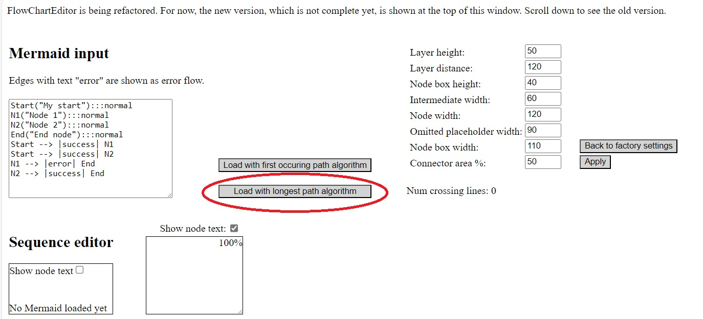

# frank-config-layout

Layout algorithm for Frank configs / flows. WeAreFrank! wishes to use a custom layout algorithm that should look better than images produced by Mermaid. This project assumes that the Frank!Framework can convert Frank configurations or adapters (XML code) to Mermaid commands. See [Mermaid example](src/assets/mermaid.txt) for the syntax of Mermaid files. This project reads Mermaid text and displays it using a custom algorithm.

The algorithm has not been finished yet. In its current state, the produced drawing does not look like intended. There is a user interface that allows humans to improve the layout. This way, the developers can investigate how to improve the algorithm. A future release of this project should eliminate the need for human intervention. A future release will also provide an artifact published on https://www.npmjs.com/ that can be used by the Frank!Framework as a replacement of Mermaid.

# Development environment and usage

To use this project, please do the following:
* Clone this project with `git clone`.
* Install package manager yarn. Presently we use version 1.22.21.
* Execute `yarn install --immutable`.
* Run the Karma tests with `yarn ng test`.
* Run the project with `yarn ng serve`.
* Open a webbrowser and go to `http://localhost:4200/`.
* In the top-left corner enter some Mermaid text. Here is a [simple example](src/assets/simpleMermaid.txt).
* Press "Load with longest path algorithm". See figure below.
* Try the controls to change the drawing.

