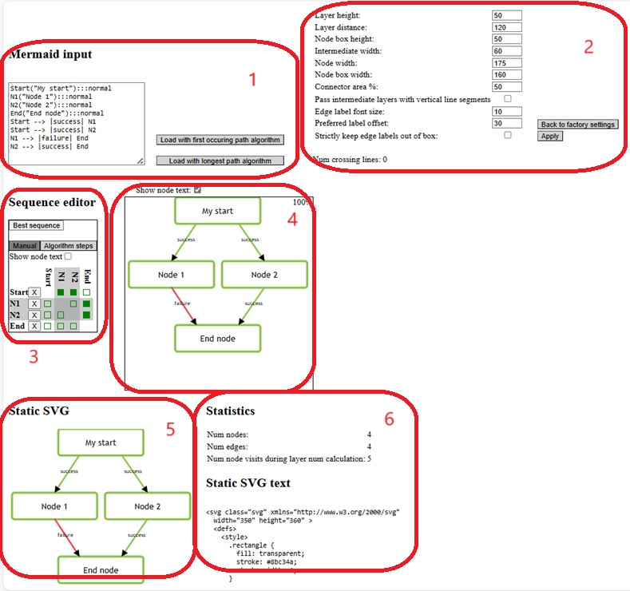

# Frank config layout playground

This GitHub project contains two angular projects. The first is [Frank config layout](./projects/frank-config-layout/README.md), which is in folder [projects/frank-config-layout](./projects/frank-config-layout). That is a library that generates pictures of Frank configurations. The second angular project is frank-config-layout-playground. It provides a graphical user interface that supports the development of frank-config-layout. This REAdME file will explain the features of frank-config-layoug-playground.

This GitHub project has a single [angular.json](./angular.json) that manages both Angular projects. Building and testing frank-config-layout is done using the scripts in the top-level [package.json](./package.json). This README explain how to test, build and publish frank-config-layout (configuration management).

This GitHub project was set up using https://github.com/frankframework/angular-library-template.

# Features of Frank config layout playground

Please keep in mind that frank-config-layout takes Mermaid text as input and that it generates SVG (Scalable Vector Graphics) text. Also remember that the generated picture depends on configurable dimensions. The figure below gives an overview of the playground:

To the top-left (number 1), you see a text field to enter Mermaid input. To get started, you can use the examples from [simpleMermaid.txt](./src/assets/simpleMermaid.txt) or [mermaid.txt](./src/assets/mermaid.txt). To get a drawing for the entered Mermaid text, press "Load with longest path algorithm". The button "Load with first occuring path algorithm" exists for historical reasons and is not so important.

The button divides the nodes defined in the Mermaid text over horizontal layers that are stacked vertically. The nodes in the first layer are on top; the nodes on the second layer are below that, et cetera. It does not optimize the sequence of the nodes within each layer.

You can use the panel on the middle-left (number 3) to manipulate the sequence of the nodes within each layer. The resulting drawing is shown next to it (number 4).

The sequence editor (number 3) supports two methods to manipulate the sequence of the nodes. In tab "Manual", you can drag and drop rows to move nodes to different (horizontal) positions within their layer. You can also remove nodes here to see how the picture would look without them. In tab "Algorithm steps", you can align the nodes while fixing the sequence within a chosen layer. Each button shows how the number of crossing lines will be changed. These are the same steps as performed by the library frank-config-layout. The library aligns on the layer for which aligning result in the biggest reduction of the number of crossing lines. It does so repeatedly until no reduction is possible anymore. In tab "Algorithm steps" you can apply the library's algorithm in a few clicks.

The result of applying the library is shown to the bottom. To the left (number 5) you see the drawing and to the right (number 6) you see the text of the SVG.

To the top-right (number 2) you can experiment with the dimensions applied. These dimensions are applied to the result produced by the sequence editor (number 4) but not the static SVG shown to the bottom (numbers 5 and 6).

# Configuration management

### Serve
Run `npm start` to build the library project first and then serve the testing project.

### Serve with live hot-reload
Run `npm run watch` to build the library on every change. Then in a new terminal run `npm start` to serve the testing project.

### Build
Run `npm run build` to build the library project using ng-packagr. The build artifacts will be stored in the `dist/%PROJECT_NAME%/` directory.

### Publishing
Run `npm publish` in the `dist/%PROJECT_NAME%/` directory in order to publish the library to a package registry.
